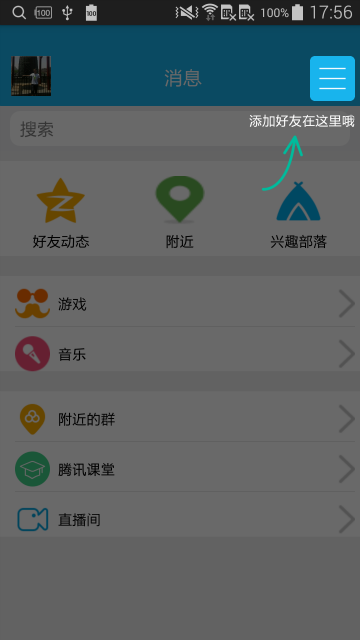
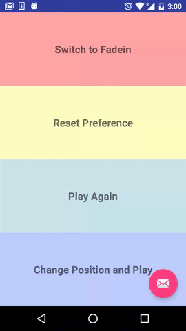
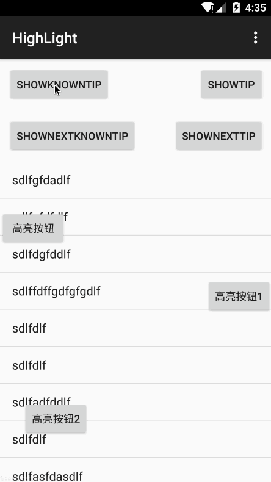
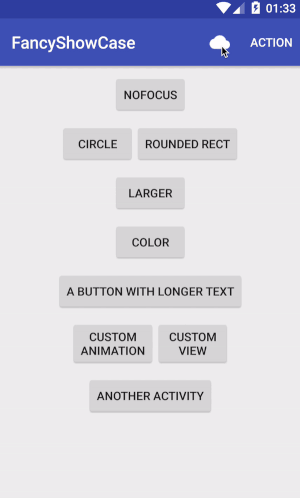
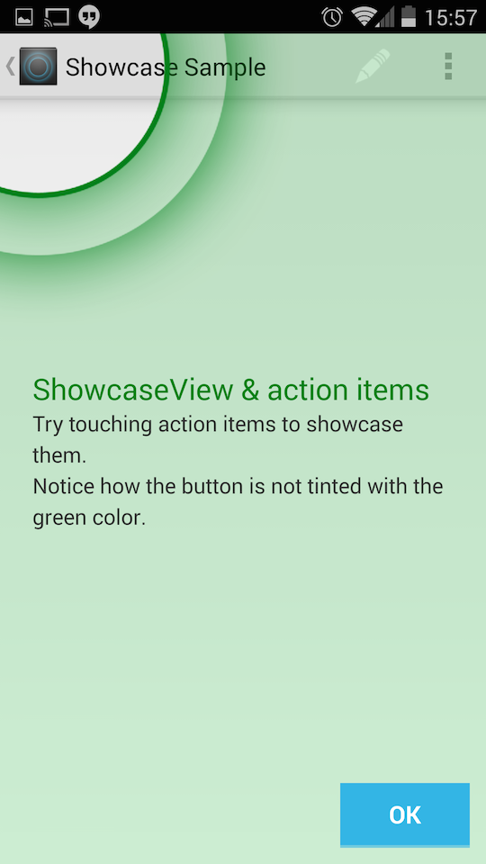
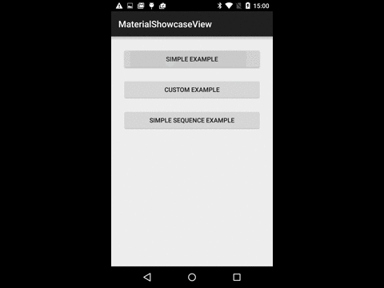

# AndroidOpenResource

> **收集积累常用的开源库和开源项目**

## 新手指引开源控件

### [GuideView](https://github.com/binIoter/GuideView)

* 最最轻量级的新手引导库，能够快速为任何一个View创建一个遮罩层，支持单个页面，多个引导提示，支持为高亮区域设置不同的图形，支持引导动画，方便扩展,良好支持fragment
* 效果图
  

### [Spotlight](https://github.com/wooplr/Spotlight)

* Spotlight is an Android library used to onboard users by showcasing specific features in the app.
* 看看下面的效果后相比静态的指引效果，这种动态指引更容易让用户耳目一新，可以在新功能的入口处添加提示。
* 效果图
  

### [MaterialIntroView](https://github.com/iammert/MaterialIntroView)

* Material Intro View is a showcase android library.
* 效果图
  

### [Highlight](https://github.com/hongyangAndroid/Highlight)

* 一个用于app指向性功能高亮的库
* 效果图
  

### [FancyShowCaseView](https://github.com/faruktoptas/FancyShowCaseView)

* An easy-to-use customisable show case view with circular reveal animation.
* 支持自定义 View 和动画等
* 效果图
  

### [ShowcaseView](https://github.com/amlcurran/ShowcaseView)

* 向你的用户快速展示应用的两点，这个控件时基于 Android 系统（Ice-Cream Sandwich 和 Jelly Bean 两个版本的 Launcher）源码中的 Cling 自定义 View 实现的。
* 效果图
  

### [MaterialShowcaseView](https://github.com/deano2390/MaterialShowcaseView)

* A Material Design themed ShowcaseView for Android
* 效果图
  

## UI相关效果

## 菜单

## 节选器

## 下拉刷新

## 模糊效果

## 进度条

## UI其他

## 动画

## 网络相关

## 图像截取

## 数据库

## 图像浏览及处理

## 视频音频处理

## 测试及调试

## 动态更新热更新

## 开源项目

## 插件

## 开源框架

## 其他

## 好的文章

## 交互篇

## 视觉篇

## UI资源

## 开发资源

## 精巧SDK

### [表情云](http://open.biaoqingmm.com/doc/sdk/)

* 一分钟拥有自己的表情商店！建立社区氛围，提升用户留存和活跃，切实可行的表情增值服务，助App轻松变现。

### [短视频-趣拍云SDK](http://docs.qupaicloud.com/)

* 趣拍云提供的手机短视频拍摄编辑SDK（视频导入、裁剪、美颜、视频编辑美化、视频本地裁剪压缩)，帮助你一天实现美拍、秒拍强大的短视频拍摄、编辑功能，同时还提供了上传、存储、加速、鉴黄、转码等云服务，帮助开发者节省视频开发成本。从官方的案例上来看，目前已合作芒果直播、美柚、优酷、钉钉、贝贝网、宝宝树、洋码头、易信等客户，累计服务1000+APP。

### [短视频-阿里云SDK](https://promotion.aliyun.com/ntms/act/videosdk.html?spm=5176.8810273.766245.2.68f97067SEeQ0K)

* 阿里云短视频SDK致力于让移动视频开发更简单，通过提供专业、成熟、稳定、易用的短视频一站式解决方案，帮助开发者节约研发成本，提高开发效率，快速上线。目前服务于支付宝、钉钉、优酷等1000+客户

### [社交分享ShareSDK](http://wiki.mob.com/)

* 这是一款简单易用社会化分享工具。开发者只需要 10 分钟就可以轻松集成到自己移动应用中。它不仅支持 QQ，新浪微博，腾讯微博，微信，Facebook 等国内外主流社交网站。还有后台统计功能，可以实时了解用户、回流率、传播效应等数据。

### [TuSDK](https://tusdk.com/doc)

* TuSDK支持iOS和 Android 两大平台，适配众多主流机型。开发者无需关心底层技术及具体实现，直接调用相应模块即可实现专业的图像处理功能，从而有效降低产品开发的技术门槛和时间成本。

### [个推](http://docs.getui.com/)

* 个推是由国内个信互动网络科技有限公司所推出的平台，帮助企业的应用通过低成本互联网通道进行消息推送，提供完善、高效、稳定的服务体系，解决了互联网云端到手机端的消息互通问题，依托于已有成熟的推送技术，建立更加稳定符合市场需求的标准化服务平台。

### [SenseTime人脸识别](https://cloud.sensetime.com/doc/api/v1/index)

* 应用性技术上，基于深度学习的人脸识别、文字识别、人体识别、车辆识别、物体识别、图像处理等技术在业界遥遥领先；业务上，商汤集团深耕金融、移动互联网、安防监控三大行业，与银联、京东、拉卡拉、华为、小米、新浪微博、科大讯飞、东方网力、英伟达等各行业巨头深度合作，推动行业产品智能化升级。

### [虚拟现实ARLab](http://www.arlab.com/) **收费**

* ARLab提供了AR技术解决方案的扩展产品组合。其中包括AR浏览器、图像匹配、3d引擎、对象跟踪、影像追踪、虚拟按键等技术。

### [人脸识别EyeKey](http://www.eyekey.com/devcenter/index.html)

* 十余年生物识别领域精耕细作，EyeKey拥有高精准度的人脸识别、虹膜识别、指纹识别等多模态生物识别算法和强大处理能力的比对集群。海量人脸数据挖掘，多层次深度神经网络，大规模服务集群，多像素规格适配。我们为所有开发者和企业提供丰富的免费人脸识别API接口，适配不同开发环境的SDK，满足不同应用环境对生物识别身份认证云服务的需求。

# 致谢

* [loading](http://www.androidchina.net/7034.html)
* [loading](http://www.androidchina.net/7028.html)
