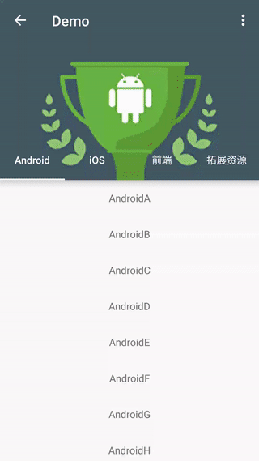
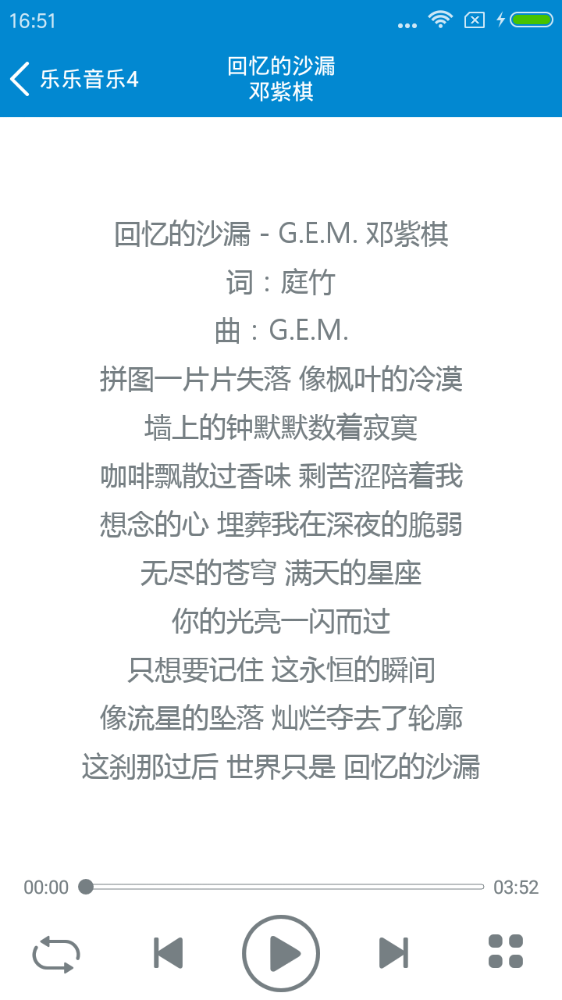

# AndroidOpenResource

> **收集积累常用的开源库和开源项目**

## 新手指引开源控件

### [GuideView](https://github.com/binIoter/GuideView)

* 最最轻量级的新手引导库，能够快速为任何一个View创建一个遮罩层，支持单个页面，多个引导提示，支持为高亮区域设置不同的图形，支持引导动画，方便扩展,良好支持fragment
* 效果图
  

### [Spotlight](https://github.com/wooplr/Spotlight)

* Spotlight is an Android library used to onboard users by showcasing specific features in the app.
* 看看下面的效果后相比静态的指引效果，这种动态指引更容易让用户耳目一新，可以在新功能的入口处添加提示。
* 效果图
  

### [MaterialIntroView](https://github.com/iammert/MaterialIntroView)

* Material Intro View is a showcase android library.
* 效果图
  

### [Highlight](https://github.com/hongyangAndroid/Highlight)

* 一个用于app指向性功能高亮的库
* 效果图
  

### [FancyShowCaseView](https://github.com/faruktoptas/FancyShowCaseView)

* An easy-to-use customisable show case view with circular reveal animation.
* 支持自定义 View 和动画等
* 效果图
  

### [ShowcaseView](https://github.com/amlcurran/ShowcaseView)

* 向你的用户快速展示应用的两点，这个控件时基于 Android 系统（Ice-Cream Sandwich 和 Jelly Bean 两个版本的 Launcher）源码中的 Cling 自定义 View 实现的。
* 效果图
  

### [MaterialShowcaseView](https://github.com/deano2390/MaterialShowcaseView)

* A Material Design themed ShowcaseView for Android
* 效果图
  

## UI相关效果

### [Toasty](https://github.com/GrenderG/Toasty)

* 一个创建自定义Toast的库。正如作者所说，这个库是：The usual Toast, but with steroids.
* 效果图
  

### [StyleableToast](https://github.com/Muddz/StyleableToast)

* A library that takes the standard Android toast to the next level with a variety of styling options. Style your toast either from code or styles.xml
* 效果图
  
  

### [CoordinatorTabLayout](https://github.com/hugeterry/CoordinatorTabLayout)

* CoordinatorTabLayout是一个自定义的组合控件，帮助你快速实现TabLayout与CoordinatorLayout相结合的样式。
* 效果图
  

### [Android-SwitchIcon](https://github.com/zagum/Android-SwitchIcon)

* 谷歌启动器风格的开关图标这个lib继承AppCompatImageView，可以使用app:srcCompat属性为SwitchIconView设置任意图标(vector 或者 image)。
* 效果图
  

### [CounterFab](https://github.com/andremion/CounterFab)

* 这是一个在浮动操作按钮的右上角显示数字标识的库。
* 效果图
  

### [FadingTextView](https://github.com/rosenpin/FadingTextView)

* 一个可以让TextView以淡如淡出的形式不断改变自己内容的库。
* 效果图
  

### [FlowLayout](https://github.com/nex3z/FlowLayout)

* 一个让子view在空间不够的情况下自动跳到下一行的布局。子view之间的间隔由 FlowLayout计算出来，以便让view是均匀分布的。
* 效果图
  

## 性能相关

### [Store](https://github.com/NYTimes/Store)

* Store是一个异步加载和缓存库。文档描述：Store是一个简化数据的请求，解析，保存，以及数据重试的类。一个Store类似于 仓库模式 ，不过用 RxJava封装成了响应式的API，以支持单向数据流 。文档非常易懂，这个库值得尝试。你可以尝试各种flows，比如数据请求，缓存，解析等。
* 原理图
  

## 菜单

### [AwesomeBar](https://github.com/florent37/AwesomeBar)

* 这是Florent Champigny的另一个很棒的库。一种 top bar 的新设计，与DrawerLayout一起协同工作。灵感来自Gmail Mobile from Weekz。
* 效果图
  

### [ArcNavigationView](https://github.com/rom4ek/ArcNavigationView)

* Another approach to create NavigationDrawer with Material concepts
* NavigationView from android design support library with curved edge
* 效果图
  

## 节选器

## 下拉刷新

## 模糊效果

## 进度条

### [PreviewSeekBar](https://github.com/rubensousa/PreviewSeekBar)

* 如果你使用Google Play Movies，你可能注意到了这个动画效果很棒，可以预览电影的SeekBar。 Rúben Sousa 实现了这种效果并开源。下面的gif图片很好的说明了其功能。如果你的app是一个播放器，你决定应该试试。
* 效果图
  

## UI其他

### [excelPanel](https://github.com/zhouchaoyuan/excelPanel)

* RecyclerView实现的二维表格，不仅可以加载历史数据，还能加载新数据。
* 效果图
  

### [Horizontal-Calendar](https://github.com/Mulham-Raee/Horizontal-Calendar)

* A material horizontal calendar view for Android based on RecyclerView
* 效果图
  

### [CameraFragment](https://github.com/florent37/CameraFragment)

* 一个集成了拍照功能的Fragment ，根据README：
  - CameraFragment直接预览camera视图，并提供简单的API来捕获或者管理设备。你可以使用 CameraFragment 设置自己的布局以及控制camera。
* 效果图
  

### [ShimmerRecyclerView](https://github.com/sharish/ShimmerRecyclerView)

* 一个可以在加载数据的时候显示闪烁(Shimmer)的RecyclerView。 这个RecyclerView内置一个adapter，控制shimmer的外观。
* 效果图
  

### [shortbread](https://github.com/MatthiasRobbers/shortbread)

* 为使用了 @Shortcut注解的Activity和方法生成 app shortcuts 。无需动用 manifest, XML以及 shortcut manager。只需为想要 shortcut调用的代码添加注释。
* 效果图
  

### [MaterialAbout](https://github.com/jrvansuita/MaterialAbout)

* 这是一个帮助你实现关于我界面的库。
* 效果图
  

## 动画

### [lottie-android](https://github.com/airbnb/lottie-android)

* 这是一个能解析 Adobe After Effects 动画导出的JSON文件并把它们渲染成本地动画的库。
* 效果图
  

## 网络相关

### [chuck](https://github.com/jgilfelt/chuck)

* Chuck is a simple in-app HTTP inspector for Android OkHttp clients. Chuck intercepts and persists all HTTP requests and responses inside your application, and provides a UI for inspecting their content.
* 效果图
  

### [bridge](https://github.com/afollestad/bridge)

* Bridge是一个简单但是强大的HTTP网络操作库。提供链式调用的API，为了最大的兼容性和最快的速度，用 Java/Android的 URLConnection类实现。

### [ason](https://github.com/afollestad/ason)

* 这是 Aidan Follestad 的第二个library。其主要目的是简化和JSON的交互。

## 数据库

### [ObjectBox](https://github.com/greenrobot/ObjectBox)

* 大家都应该知道 greenrobot ，不知道的话也应该知道他们开发的 GreenDAO 和 EventBus 。这次要介绍的是一个面向对象的数据库。greenrobot宣称：
  - 性能是我们创建ObjectBox的首要因素。之前我们创建了安卓和 SQLite上 最快的对象关系映射 (ORM) greenDAO 。自从2011年第一个版本发布以来，我们对对象持久化-以及 SQLite的缺陷有了许多认识。我们意识到， 要显著提高移动端的性能，需要从核型开始，创建一个基于对象的数据库。
  - 请注意目前ObjectBox还是测试版本(0.9.13)。

### [greenDAO](https://github.com/greenrobot/greenDAO)

* greenDAO is a light & fast ORM solution for Android that maps objects to SQLite databases. 

## 图像浏览及处理

### [boxing](https://github.com/Bilibili/boxing)

* Boxing是一个基于MVP模式的Android多媒体选择器，你可以：
  - 图片选择(单/多选)，
  - 预览或者剪裁图片。
  - 它还支持gif，视图选择，图片压缩以及自定义UI：
* 效果图
  

## 视频音频处理

## 测试及调试

## 动态更新热更新

## 开源项目

### [乐乐音乐4.0-AS版本](https://github.com/zhangliangming/HappyPlayer-AS)

* 支持mp3、ape、flac、wav音频格式，支持ksc、krc、hrc和hrcx歌词格式文件，是一款不错的android音乐播放器
* 效果图
  

### [仿网易云音乐](https://github.com/aa112901/remusic)

* 音乐播放器 在线 下载
* 效果图
  

### [简阅客户端](https://github.com/chentao0707/SimplifyReader)

* 一款基于Google Material Design设计开发的Android客户端，包括新闻简读，图片浏览，视频爽看 ，音乐轻听以及二维码扫描五个子模块。项目采取的是MVP架构开发，由于还是摸索阶段，可能不是很规范。但基本上应该是这么个套路，至少我个人认为是这样的~恩，就是这样的！
* 效果图
  

### [豆芽客户端](https://github.com/DreaminginCodeZH/Douya)

* 开源的 Material Design 豆瓣客户端（A Material Design app for douban.com）
* 效果图
  

### [即时通讯：嗨豹](https://github.com/sealtalk/sealtalk-android)

* 基于融云开发的 Android 版即时通讯（IM）应用程序 - 嗨豹。还能发红包
* 效果图
  

### [洛克商城](https://github.com/Shuyun123/LKShop)

* 简单商城 开源版， 包括用户注册、登录、密码找回、短信验证、用户分享、消息推送、订单上传、商品分类、商品收藏、购物车订单的增添、删除、商品查询、用户设置、用户评价、用户评论等基本功能。
* 效果图
  

### [LeafPic](https://github.com/HoraApps/LeafPic)

* 照片墙类的app是比较常见的。你是否有想过它们是如何开发的呢?LeafPic就是一个比较好的开源照片墙类的APP。包含切换主题功能。
* 效果图
  

### [Simple Calendar](https://github.com/SimpleMobileTools/Simple-Calendar)

* 这是一款用**Kotlin**语言编写的日历app。如果你想学Kotlin，这个开源项目绝对能帮到你。该项目还可以帮助你学习到添加桌面小工具。
* 效果图
  

### [Easy Sound Recorder](https://github.com/dkim0419/SoundRecorder)

* 这是一款简单的录音app。如果你想学关于录音方面，这个开源项目可以帮到你。该项目只有一个Activity，代码非常好理解，并且采用的是MD设计。
* 效果图
  

### [MLManager](https://github.com/javiersantos/MLManager)

* 该软件可帮助管理手机里面的apps。从这个项目中可以学到如果获取软件的详细信息，导出apk，卸载软件等功能。这个项目的编码风格很好，可以借鉴，它的简洁代码设计和MD设计都可以参考。
* 效果图
  

### [photo-affix](https://github.com/afollestad/photo-affix)

* 这款应用可以水平或者垂直合并图像。从它的代码中可以学到简单的自定义控件基础。
* 效果图
  

### [MovieGuide](https://github.com/esoxjem/MovieGuide)

* Movie discovery app showcasing MVP, RxJava, Dagger 2 and Clean Architecture. Popcorn?
* 效果图
  

### [AnExplorer](https://github.com/1hakr/AnExplorer)

* 同样是一款轻量级的文件管理器，适用于手机和平板。root管理，loaders，自定义控件等功能都可以从这个项目中学到。
* 效果图
  

### [Minimal ToDo](https://github.com/avjinder/Minimal-Todo)

* A fully Material ToDo app with minimal features, just enough to be useful.
* 效果图
  

### [Timber](https://github.com/naman14/Timber)

* Material Design Music Player
* 效果图
  

### [AnotherMonitor](https://github.com/AntonioRedondo/AnotherMonitor)

* Monitors and records the CPU and memory usage of Android devices
* 效果图
  

### [InstaMaterial](https://github.com/frogermcs/InstaMaterial)

* 该项目学习了Instagram这款应用的材料设计，正好可以帮助你提高你的MD水平。
* 效果图
  

### [CoCoin](https://github.com/Nightonke/CoCoin)

* Cocoin是一款个人财务记账软件。该项目可以帮助你学到操作大量用户数据，绘制漂亮的表格，自定义比较酷的控件等。
* 效果图
  

### [Omni-Notes](https://github.com/federicoiosue/Omni-Notes)

* 该项目由大量的功能，比如分享和收缩note，在note中可添加图片，视频，音频，sketch等附件，还可以添加提醒人。
* 效果图
  

### [superCleanMaster](https://github.com/joyoyao/superCleanMaster)

* 一键清理 开源版，包括内存加速，缓存清理，自启管理，软件管理等。
* 效果图
  

### [Travel-Mate](https://github.com/Swati4star/Travel-Mate)

* A complete travel guide
* 效果图
  

### [turbo-editor](https://github.com/vmihalachi/turbo-editor)

* Simple and powerful File Editor for Android. All is licensed under the GPLv3 license.
* 效果图
  

### [Pedometer](https://github.com/j4velin/Pedometer)

* Lightweight pedometer app for Android using the hardware step sensor
* 效果图
  

## 插件

## 开源框架

## 其他

## 好的文章

## 交互篇

## 视觉篇

## UI资源

## 开发资源

## 精巧SDK

### [表情云](http://open.biaoqingmm.com/doc/sdk/)

* 一分钟拥有自己的表情商店！建立社区氛围，提升用户留存和活跃，切实可行的表情增值服务，助App轻松变现。

### [短视频-趣拍云SDK](http://docs.qupaicloud.com/)

* 趣拍云提供的手机短视频拍摄编辑SDK（视频导入、裁剪、美颜、视频编辑美化、视频本地裁剪压缩)，帮助你一天实现美拍、秒拍强大的短视频拍摄、编辑功能，同时还提供了上传、存储、加速、鉴黄、转码等云服务，帮助开发者节省视频开发成本。从官方的案例上来看，目前已合作芒果直播、美柚、优酷、钉钉、贝贝网、宝宝树、洋码头、易信等客户，累计服务1000+APP。

### [短视频-阿里云SDK](https://promotion.aliyun.com/ntms/act/videosdk.html?spm=5176.8810273.766245.2.68f97067SEeQ0K)

* 阿里云短视频SDK致力于让移动视频开发更简单，通过提供专业、成熟、稳定、易用的短视频一站式解决方案，帮助开发者节约研发成本，提高开发效率，快速上线。目前服务于支付宝、钉钉、优酷等1000+客户

### [社交分享ShareSDK](http://wiki.mob.com/)

* 这是一款简单易用社会化分享工具。开发者只需要 10 分钟就可以轻松集成到自己移动应用中。它不仅支持 QQ，新浪微博，腾讯微博，微信，Facebook 等国内外主流社交网站。还有后台统计功能，可以实时了解用户、回流率、传播效应等数据。

### [TuSDK](https://tusdk.com/doc)

* TuSDK支持iOS和 Android 两大平台，适配众多主流机型。开发者无需关心底层技术及具体实现，直接调用相应模块即可实现专业的图像处理功能，从而有效降低产品开发的技术门槛和时间成本。

### [个推](http://docs.getui.com/)

* 个推是由国内个信互动网络科技有限公司所推出的平台，帮助企业的应用通过低成本互联网通道进行消息推送，提供完善、高效、稳定的服务体系，解决了互联网云端到手机端的消息互通问题，依托于已有成熟的推送技术，建立更加稳定符合市场需求的标准化服务平台。

### [SenseTime人脸识别](https://cloud.sensetime.com/doc/api/v1/index)

* 应用性技术上，基于深度学习的人脸识别、文字识别、人体识别、车辆识别、物体识别、图像处理等技术在业界遥遥领先；业务上，商汤集团深耕金融、移动互联网、安防监控三大行业，与银联、京东、拉卡拉、华为、小米、新浪微博、科大讯飞、东方网力、英伟达等各行业巨头深度合作，推动行业产品智能化升级。

### [虚拟现实ARLab](http://www.arlab.com/) **收费**

* ARLab提供了AR技术解决方案的扩展产品组合。其中包括AR浏览器、图像匹配、3d引擎、对象跟踪、影像追踪、虚拟按键等技术。

### [人脸识别EyeKey](http://www.eyekey.com/devcenter/index.html)

* 十余年生物识别领域精耕细作，EyeKey拥有高精准度的人脸识别、虹膜识别、指纹识别等多模态生物识别算法和强大处理能力的比对集群。海量人脸数据挖掘，多层次深度神经网络，大规模服务集群，多像素规格适配。我们为所有开发者和企业提供丰富的免费人脸识别API接口，适配不同开发环境的SDK，满足不同应用环境对生物识别身份认证云服务的需求。

### [weixin-java-tools](https://github.com/wechat-group/weixin-java-tools)

* 微信支付、小程序、企业号和公众号（包括服务号和订阅号） Java SDK开发工具包

# 致谢

* [loading](http://www.androidchina.net/7034.html)
* [loading](http://www.androidchina.net/7028.html)
