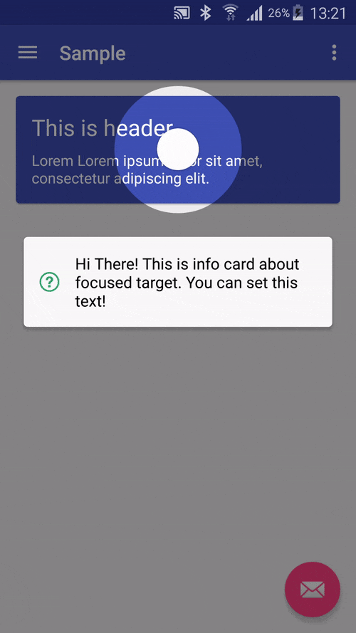

# AndroidOpenResource

> **收集积累常用的开源库和开源项目**

## 新手指引开源控件

### [GuideView](https://github.com/binIoter/GuideView)

* 最最轻量级的新手引导库，能够快速为任何一个View创建一个遮罩层，支持单个页面，多个引导提示，支持为高亮区域设置不同的图形，支持引导动画，方便扩展,良好支持fragment
* 效果图
  

### [Spotlight](https://github.com/wooplr/Spotlight)

* Spotlight is an Android library used to onboard users by showcasing specific features in the app.
* 看看下面的效果后相比静态的指引效果，这种动态指引更容易让用户耳目一新，可以在新功能的入口处添加提示。
* 效果图
  

### [MaterialIntroView](https://github.com/iammert/MaterialIntroView)

* Material Intro View is a showcase android library.
* 效果图
  

### [Highlight](https://github.com/hongyangAndroid/Highlight)

* 一个用于app指向性功能高亮的库
* 效果图
  

### [FancyShowCaseView](https://github.com/faruktoptas/FancyShowCaseView)

* An easy-to-use customisable show case view with circular reveal animation.
* 支持自定义 View 和动画等
* 效果图
	
	
### [ShowcaseView](https://github.com/amlcurran/ShowcaseView)

* 向你的用户快速展示应用的两点，这个控件时基于 Android 系统（Ice-Cream Sandwich 和 Jelly Bean 两个版本的 Launcher）源码中的 Cling 自定义 View 实现的。
* 效果图
	
	
### [MaterialShowcaseView](https://github.com/deano2390/MaterialShowcaseView)

* A Material Design themed ShowcaseView for Android
* 效果图
	

## UI相关效果

## 菜单

## 节选器

## 下拉刷新

## 模糊效果

## 进度条

## UI其他

## 动画

## 网络相关

## 图像截取

## 数据库

## 图像浏览及处理

## 视频音频处理

## 测试及调试

## 动态更新热更新

## 开源项目

## 插件

## 开源框架

## 其他

## 好的文章

## 交互篇

## 视觉篇

## UI资源

## 开发资源

## 精巧SDK

# 致谢

* [loading](http://www.androidchina.net/7034.html)
* [loading](http://www.androidchina.net/7028.html)
